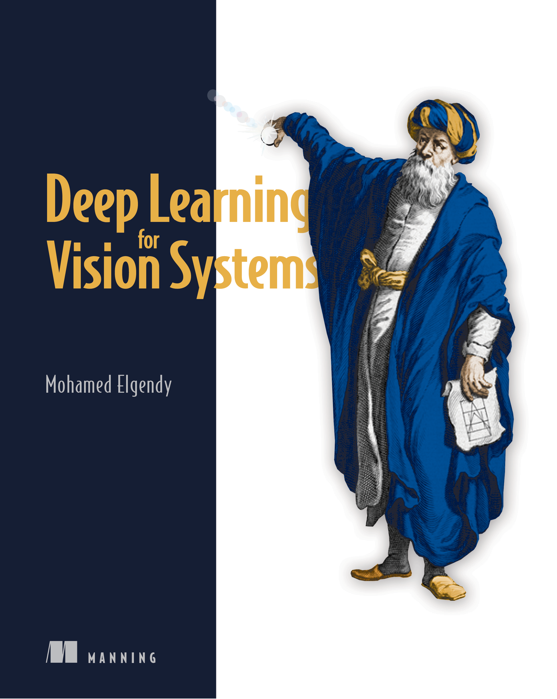

--- 
title: "R Code for Deep Learning for Vision Systems"
author: "Jarrett Byrnes"
date: "`r Sys.Date()`"
site: bookdown::bookdown_site
output: bookdown::gitbook
documentclass: book
github-repo: jebyrnes/r_deep_learning_vision_systems
description: "This is an attempt to translate Deep Learning for Vision Systems into R code using the keras and tensorflow library."
---


```{r setup}
library(knitr)
knitr::opts_chunk$set(warning = FALSE, message = FALSE)
```

# This Project {-}

## Introduction {-}
<center>
{width=50%}
</center>

This is an attempt to translate [Deep Learning for Vision Systems](https://www.manning.com/books/deep-learning-for-vision-systems) by Mohamed Elgendy into R code using the keras and tensorflow library in order for R users who are not familiar with python to run code from the book.

## Prerequisites to run this code {-}

To run the code in this bookdown, please install the following packages:

```{r eval=FALSE}
install.packages("tidyverse")
install.packages("keras")
install.packages("tensorflow")
```

I hope you find this usefu!
